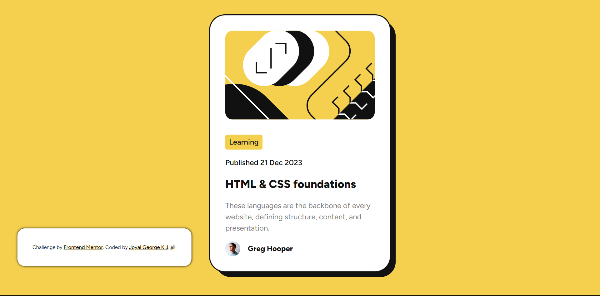

# Frontend Mentor - Blog preview card

## Welcome! 👋

Thanks for checking out this front-end coding challenge.

[Frontend Mentor](https://www.frontendmentor.io) challenges help you improve your coding skills by building realistic projects.

**To do this challenge, you need a basic understanding of HTML and CSS.**

## Table of contents
- [The challenge](#the-challenge)
- [Screenshot](#screenshot)
- [Built with](#built-with)
- [What I learned](#what-i-learned)
- [Useful resources](#useful-resources)
- [Author](#author)
- [Acknowledgments](#acknowledgments)

## The challenge

Users should be able to:

- View the optimal layout for the interface depending on their device's screen size
- See hover and focus states for all interactive elements on the page

## Screenshot

## Built with

- Semantic HTML5 markup
- CSS custom properties
- Flexbox
- CSS Grid
- Bootstrap 5

## What I learned

 - Nothing much

## Useful resources

- If you Know the basics of HTML & CSS you can do this! 

## Author

- Frontend Mentor - [@Joyal-George-KJ](https://www.frontendmentor.io/profile/Joyal-George-KJ)
- Twitter - [@JoyalGeorgeKJ](https://www.twitter.com/JoyalGeorgeKJ)

## Acknowledgments

I love doing FrontEnd Stuff and this was really nice to do, you will learn/understand the concept of grid with this challenge
